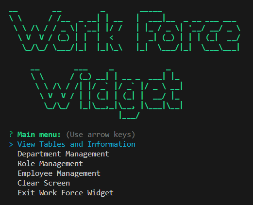
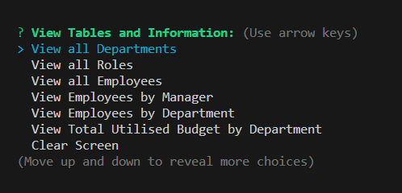
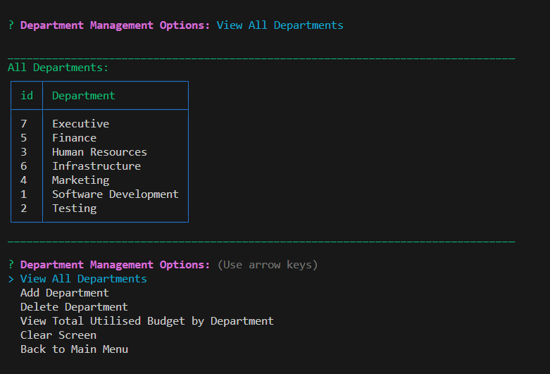
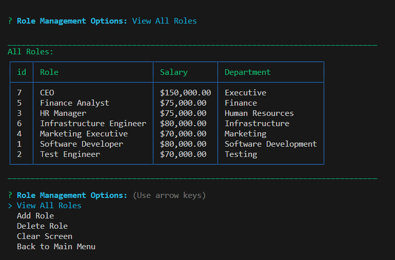
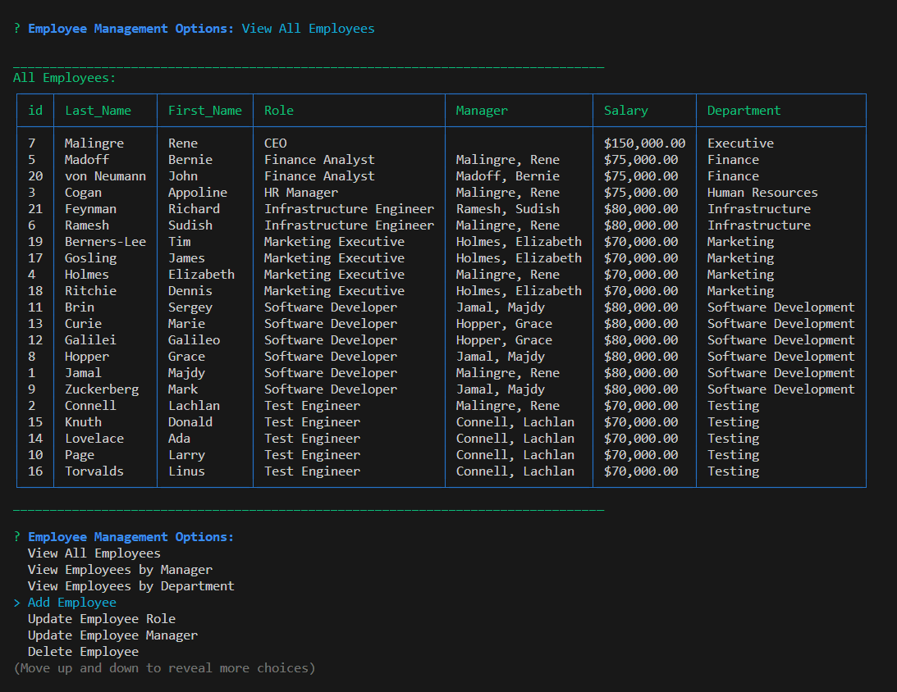
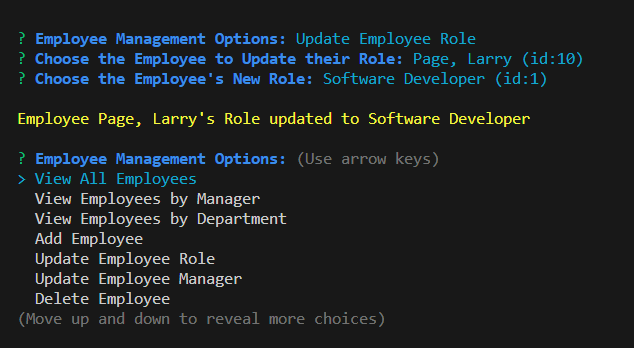

# Work Force Widget

 [](https://opensource.org/licenses/MIT)

A business employee tracker database program, run from the command line.

## Description

This is a command line application that allows the user to view and manage the departments, roles, and employees in a company.  

The user can:

- add departments, roles, and employees
- view departments, roles, and employees.
- filter employees by manager or department.
- update employee roles and update employee managers.
- delete departments, roles, and employees.
- view the total utilised budget of a department (ie the combined salaries of all employees in that department).

## Table of Contents

- [Technologies Used](#technologies-used)
- [Installation](#installation)
- [Usage](#usage)
- [Demo](#demo)
- [Credits](#credits)
- [License](#license)
- [Contributing](#contributing)
- [Questions](#questions)

## Technologies Used

- JavaScript
- Node.js
- MySQL
- mysql2 npm package for connecting to MySQL database
- Inquirer npm package for command line user prompts
- cli-table3 npm package for formatting tables in the command line
- dotenv npm package for storing environment variables
- chalk npm package for styling command line text
  
## Installation
  
Fork or copy the repository to your own machine. To install the necessary dependencies, run the following command in the terminal:
  
```bash
npm i
```

## Usage

 To run the app in the development environment, open the terminal and navigate to the directory where you copied the repository.  Run the following command:

```bash
node index.js
```

The app will start and display the main menu:



The main menu can be traversed with keyboard arrow keys and the enter key.  The application options are accessible from the main menu.  The options are split into 4 categories:

- view tables and information
- department functions
- role functions
- employee functions

There is duplication of functionality between the view tables and information option and the department, role, and employee functions.  The view tables and information option is provided for convenience, so that the user can view all tables and information without having to navigate through the other options.

When the user selects to view information, formatted tables are displayed in the terminal.

### View tables and information

This screenshot shows the view tables and information menu:



### Department functions

This screenshot shows sample departments and the Department Management menu:



### Role functions

This screenshot shows sample roles and the Role Management menu:



### Employee functions

This screenshot shows sample employees and the Employee Management menu:



#### Update Employee Role

This screenshot shows the Update Employee Role prompt process:



## Demo

A demo of the application can be viewed [here](https://drive.google.com/file/d/14o-ebJ7OYZJH48wHNGI6L6yVAdBzabis/view?usp=sharing).

It is also saved in this repository as [walkthrough_2x.mp4](./docs/video/walkthrough_2x.mp4).

## Credits

JavaScript runtime: [Node.js](https://nodejs.org/en/)

MySQL database: [MySQL](https://www.mysql.com/)

MySQL npm package: [mysql2](https://www.npmjs.com/package/mysql2)

Command line user prompts: [Inquirer](https://www.npmjs.com/package/inquirer)

Command line table formatting: [cli-table3](https://www.npmjs.com/package/cli-table3)

Environment variables: [dotenv](https://www.npmjs.com/package/dotenv)

Command line text styling: [chalk](https://www.npmjs.com/package/chalk)

## License
  
This repository is licensed under the [MIT](https://opensource.org/licenses/MIT) license.
  
## Contributing
  
Contributions to this project will not be accepted, as this project is an assessment piece for a coding course, and it must be the project author's own work. However, feel free to fork the repository and make your own changes.
  
## Questions
  
If you have any questions about the repository, open an issue or contact me directly at:
[rene.malingre@gmail.com](mailto:rene.malingre@gmail.com).
  
You can find more of my work at [GitHub](https://github.com/ReneMalingre).
